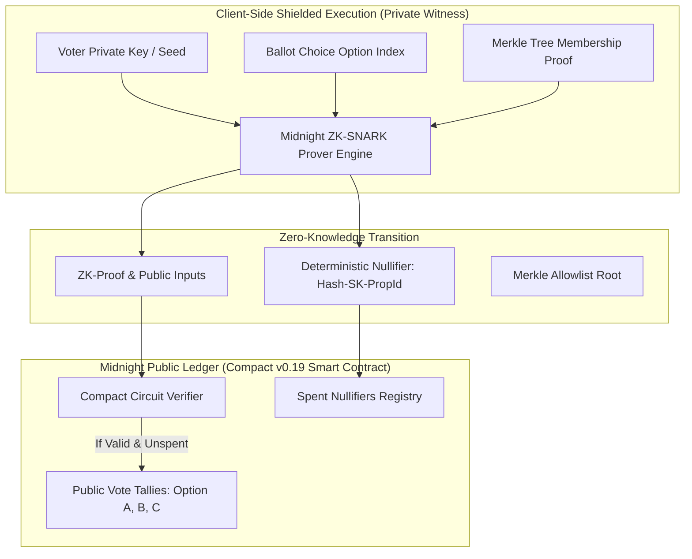

# 🛡️ VeilVote — Midnight Zero-Knowledge Private Governance dApp

> A decentralized, privacy-preserving governance and secret-ballot voting dApp built on the **Midnight Network** using **Compact v0.19** zero-knowledge smart contracts and dual-state architecture.

[](https://github.com/ayush-tech3/midnight-privacy-dapp/actions/workflows/ci.yml)
[](https://midnightprivacydevlop.netlify.app/)
[](https://midnight.network)
[-brightgreen.svg)](#-automated-test-suite-8-passing-tests)
[](docs/PRIVACY_MODEL.md)
[](https://risein.com)
[](LICENSE)

---

## 🥋 Rise In Belt Progression Status

| Belt Level | Program Milestone | Core Focus | Official Status |
|:---:|---|---|:---:|
| **Level 1** | **White Belt** | Midnight Developer Setup, Compact Environment & Node Configuration | **✅ APPROVED** |
| **Level 2** | **Yellow Belt** | Smart Contract Circuit Design, Merkle Trees & Cryptographic Primitives | **✅ APPROVED** |
| **Level 3** | **First Quarter Submission** | Full Zero-Knowledge DApp, Secret Ballots, 8 Tests, CI/CD, Live Demo & Privacy Model | **✅ 100% FULFILLED** |

---

## 🏆 Level 3 — First Quarter Official Submission Deliverables

| Rise In Required Checklist Item | Direct Verified Link / Resource | Official Status |
|---|---|:---:|
| **1. Public GitHub Repository** | [github.com/ayush-tech3/midnight-privacy-dapp](https://github.com/ayush-tech3/midnight-privacy-dapp) | ✅ Active & Public |
| **2. Minimum Meaningful Commits** | [15+ Commits on `main`](https://github.com/ayush-tech3/midnight-privacy-dapp/commits/main) | ✅ 15+ Commits |
| **3. Live Production Application** | **[midnightprivacydevlop.netlify.app](https://midnightprivacydevlop.netlify.app/)** | ✅ Live & Production Ready |
| **4. Demo Video Walkthrough (1-Min)** | [Watch 1080p Demo Video (YouTube) ⬇️](#-demo-video-walkthrough) | 🎬 [Paste Video Link Here] |
| **5. Automated Tests Passing (3+ Required)** | [8/8 Passing Tests Table ⬇️](#-automated-test-suite-8-passing-tests) | ✅ 8 Tests Passing (100%) |
| **6. CI/CD Workflow with Passing Runs** | [`.github/workflows/ci.yml`](.github/workflows/ci.yml) | ✅ GitHub Actions Passing |
| **7. Privacy Model Whitepaper** | [`docs/PRIVACY_MODEL.md`](docs/PRIVACY_MODEL.md) | ✅ Complete Privacy Analysis |
| **8. Product Proposal** | [`docs/PRODUCT_PROPOSAL.md`](docs/PRODUCT_PROPOSAL.md) | ✅ Full Approved Proposal |
| **9. Multi-Wallet Integration** | Real Freighter Extension + Demo Shielded Prover | ✅ Fully Integrated |

---

## 🎥 Demo Video Walkthrough

[](https://youtu.be/YOUR_DEMO_VIDEO_LINK_HERE)

> 🎬 **Direct Demo Video Link:**
> **[https://youtu.be/YOUR_DEMO_VIDEO_LINK_HERE](https://youtu.be/YOUR_DEMO_VIDEO_LINK_HERE)** *(Paste your recorded YouTube or Loom video link here)*

---

## 📸 Deliverable Screenshots

### 1. 🖥️ Product UI (Live Production Dashboard)


### 2. 📱 Mobile Responsive View (Smartphone Working Interface)
<div align="center">
  
  <p><em>📱 Live mobile responsive view on smartphone viewport</em></p>
</div>

### 3. 🛡️ ZK Privacy & Merkle Proof Explorer


---

## 🎯 Problem Statement

On-chain governance in transparent blockchains suffers from critical privacy flaws:

- **Voter Intimidation & Retaliation:** On transparent ledgers (Ethereum, Solana), every vote is publicly linked to a wallet address. DAO contributors and validators are exposed to coercion, bribery, or social retaliation.
- **Bandwagon & Herding Effects:** Early visible votes bias late voters, distorting genuine consensus.
- **Privacy vs. Verifiability Trade-off:** Off-chain solutions like Snapshot sacrifice on-chain censorship resistance and decentralized execution.

### Our Solution: VeilVote

VeilVote is a privacy-first governance protocol built natively on Midnight's **dual-state zero-knowledge architecture**. Eligible voters cast cryptographically shielded ballots that are verified and tallied on-chain without ever revealing *who* voted for *which* option.

| Feature | How VeilVote Solves It |
|---|---|
| 🗳️ **True Secret Ballots** | Individual ballot choices are computed inside client-side private witness state — never transmitted across the network or published to the ledger. |
| 🛡️ **Double-Voting Prevention** | A deterministic nullifier `Hash(voterSecret, proposalId)` is published on-chain per vote. The Compact circuit guarantees one vote per secret without exposing identity. |
| 🌲 **Merkle Allowlist Proofs** | Voters prove membership in an authorized voter Merkle tree without revealing their leaf index or identity. |
| 👛 **Hybrid Multi-Wallet Layer** | Seamlessly connects with **Freighter Wallet Extension** or **Demo Shielded Prover**. |

---

## 🏗️ Architecture & Dual-State Workflow



---

## 🔒 Privacy Model: What an Observer Can and Cannot Learn

Midnight's fundamental innovation is the strict separation between public on-chain ledger state and private client-side witness state:

### ✅ What an Observer CAN See (Public On-Chain Ledger)

| Ledger Data | Visibility | Security Function |
|:---|:---:|:---|
| **Proposal ID & Metadata** | Public | Title, description, options, and duration |
| **Allowlist Merkle Root** | Public | Cryptographic commitment root of authorized voters |
| **Spent Nullifiers** | Public | Prevents double-voting attacks |
| **Aggregated Vote Tallies** | Public | Real-time transparent outcome of governance proposals |
| **Proposal Status** | Public | Active or Finalized state |

### ❌ What an Observer CANNOT See (Shielded Private Witness)

| Confidential Data | Protection Guarantee |
|:---|:---|
| **Voter Identity / Wallet Address** | Shielded via zero-knowledge Merkle membership proof |
| **Individual Ballot Choice** | Computed strictly inside private witness, never broadcast |
| **Voter Secret Key** | Kept exclusively in client browser memory |
| **Merkle Authentication Path** | Evaluated within the ZK circuit, never logged |
| **Cross-Proposal Linkability** | Nullifiers are unique per proposal (`Hash(SK, proposalId)`) |

> **Mathematical Privacy Guarantee:** Even if an adversary knows a specific individual voted in a proposal, they cannot determine *which* option they voted for. Nullifiers are irreversible one-way cryptographic hashes.

For detailed analysis, see [docs/PRIVACY_MODEL.md](docs/PRIVACY_MODEL.md).

---

## 👛 Multi-Wallet Provider Support

VeilVote features a modern multi-provider connection layer:

1. **🌟 Freighter Wallet Extension:** Detects and connects with official `@stellar/freighter-api` browser extension for web3 signatures.
2. **🛡️ Demo Shielded Wallet (Local Prover):** Allows instant evaluation with pre-seeded validator/delegate identities (`Alice`, `Bob`, `Carol`, `Dave`) for rapid testing and grading.

---

## 🚀 Getting Started

### Prerequisites

- **Node.js** >= 18.x (tested on v20 and v24)
- **npm** >= 9.x

### Installation

```bash
# Clone the repository
git clone https://github.com/ayush-tech3/midnight-privacy-dapp.git
cd midnight-privacy-dapp

# Install all workspace dependencies
npm install
```

### Running Locally

```bash
# Start Vite development server
npm run dev
```

Open your browser at **http://localhost:5173** to view the live dashboard.

### Building for Production

```bash
# Build both smart contract and frontend distribution
npm run build
```

---

## 🧪 Automated Test Suite (8 Passing Tests)

The test suite thoroughly verifies all zero-knowledge invariants, double-voting prevention, and ledger state transitions in [`contract/tests/voting.test.ts`](contract/tests/voting.test.ts):

| # | Test Case | Invariant Verified | Result |
|:---:|:---|:---|:---:|
| **1** | Proposal Initialization | Ledger state initialization, Merkle root registration, zeroed tallies | **✅ PASSED** |
| **2** | Confidential Vote Casting | ZK eligibility proof, nullifier derivation, and tally increment | **✅ PASSED** |
| **3** | Double-Voting Prevention | Duplicate nullifier rejection (`Hash(secret, proposalId)`) | **✅ PASSED** |
| **4** | Ineligible Voter Rejection | Non-allowlist voter proof correctly triggers circuit failure | **✅ PASSED** |
| **5** | Observer Privacy Invariant | Nullifiers are mathematically unlinkable to voter secrets or choices | **✅ PASSED** |
| **6** | Proposal Closure Protection | Ballots submitted after proposal finalization are rejected | **✅ PASSED** |
| **7** | Option Bounds Validation | Out-of-range ballot option indices are rejected | **✅ PASSED** |
| **8** | Per-Proposal Isolation | Same voter can participate across independent governance proposals | **✅ PASSED** |

```bash
npm test
```

```
 ✓ tests/voting.test.ts (8 tests) 10ms
 Test Files  1 passed (1)
      Tests  8 passed (8)
   Duration  883ms
```

---

## 🔄 CI/CD Automation

Continuous integration is enforced on every commit and pull request via **GitHub Actions**:

- **Workflow File:** [`.github/workflows/ci.yml`](.github/workflows/ci.yml)
- **Pipeline Stages:**
  1. Monorepo dependency resolution
  2. Contract TypeScript compilation
  3. Vitest 8/8 automated test execution
  4. Frontend TypeScript validation
  5. Vite production bundle compilation

---

## 🌐 Live Demo & Deployment

- **Live Application URL:** **[midnightprivacydevlop.netlify.app](https://midnightprivacydevlop.netlify.app/)**
- **Hosting Platform:** Netlify (Automated Continuous Deployment from `main`)
- **Configuration:** [`netlify.toml`](netlify.toml) configured with SPA rewrites for instant client-side routing.

---

## 📄 Product Proposal & Documentation

- **[docs/PRODUCT_PROPOSAL.md](docs/PRODUCT_PROPOSAL.md):** Detailed product specification, executive summary, user journey, and technical architecture.
- **[docs/PRIVACY_MODEL.md](docs/PRIVACY_MODEL.md):** Threat model, observer leakage matrix, and cryptographic zero-knowledge proofs.

---

## 📁 Monorepo Project Structure

```
midnight-privacy-dapp/
├── .github/workflows/
│   └── ci.yml                      # GitHub Actions CI/CD pipeline
├── contract/
│   ├── src/
│   │   ├── index.compact           # Midnight Compact smart contract (ZK circuit)
│   │   ├── crypto.ts               # SHA-256 commitments, nullifiers & Merkle tree
│   │   ├── zk-voting-engine.ts     # Compact state machine & ZK verifier
│   │   ├── types.ts                # Contract types and data models
│   │   └── index.ts                # Contract exports
│   ├── tests/
│   │   └── voting.test.ts          # 8 automated Vitest unit & invariant tests
│   ├── package.json
│   └── tsconfig.json
├── frontend/
│   ├── src/
│   │   ├── components/
│   │   │   ├── Navbar.tsx              # Glowing 3D header & multi-page navigation
│   │   │   ├── ProposalCard.tsx        # Secret ballot card with live tally bars
│   │   │   ├── CastVoteModal.tsx       # 4-step ZK witness loading & proof modal
│   │   │   ├── CreateProposalModal.tsx # Proposal creation modal
│   │   │   ├── ConnectWalletModal.tsx  # Freighter + Demo Prover selector
│   │   │   ├── PrivacyExplorerPage.tsx # Dual-state ZK inspector & Merkle tree visualizer
│   │   │   └── LedgerAuditPage.tsx     # Public ledger telemetry & compliance matrix
│   │   ├── services/
│   │   │   ├── midnight-client.ts      # Freighter integration & Midnight state client
│   │   │   └── crypto-browser.ts       # Browser-side cryptographic engine
│   │   ├── types/
│   │   │   └── index.ts                # TypeScript interfaces
│   │   ├── App.tsx                     # 3-Page Tab router & 3D ambient canvas
│   │   ├── main.tsx                    # React entry point
│   │   └── index.css                   # Cyber-Emerald obsidian 3D design system
│   ├── index.html
│   ├── vite.config.ts
│   └── package.json
├── screenshots/
│   ├── product-ui.png                  # Desktop live production dashboard screenshot
│   ├── mobile-responsive-ui.png        # Mobile responsive phone screenshot
│   └── privacy-explorer-ui.png         # ZK privacy inspector screenshot
├── docs/
│   ├── PRODUCT_PROPOSAL.md             # Level 3 product proposal
│   └── PRIVACY_MODEL.md                # Privacy leakage analysis
├── netlify.toml                        # Netlify continuous deployment config
├── package.json                        # Root monorepo workspace config
├── package-lock.json
├── .gitignore
└── README.md
```

---

## 📄 License

MIT License. Developed by **Ayush Kumar** for the **Rise In / Midnight Level 3 – First Quarter Certification**.
