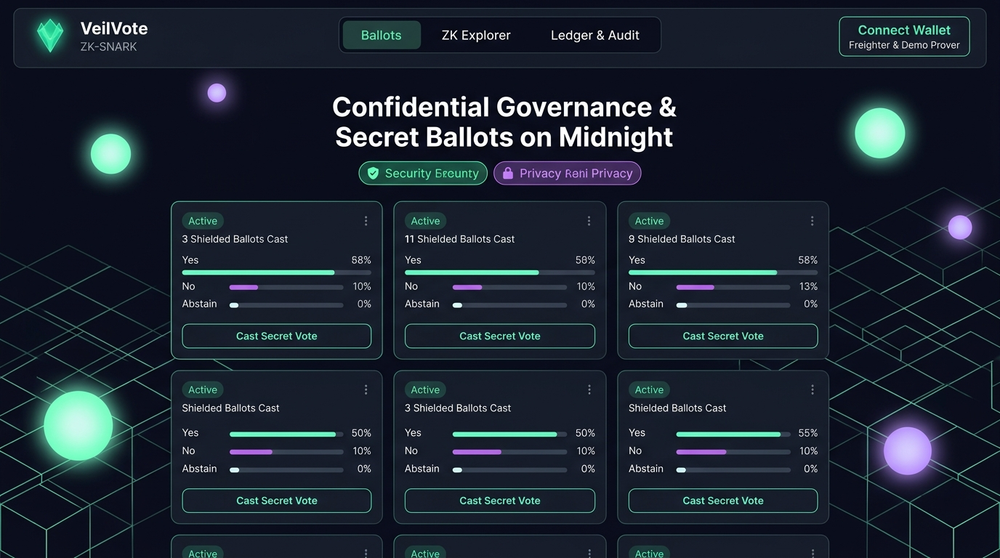
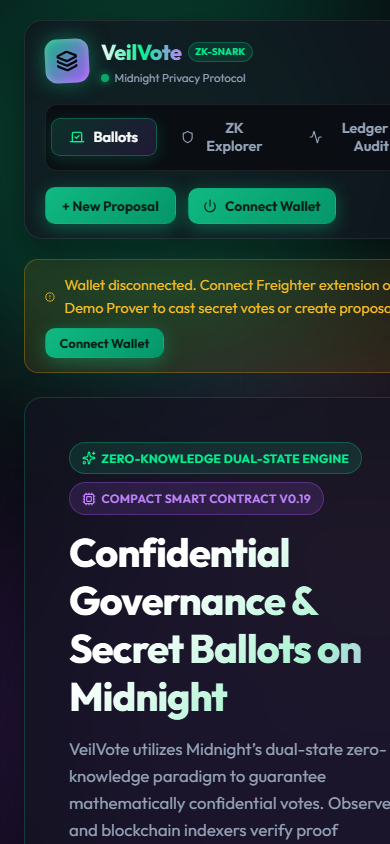
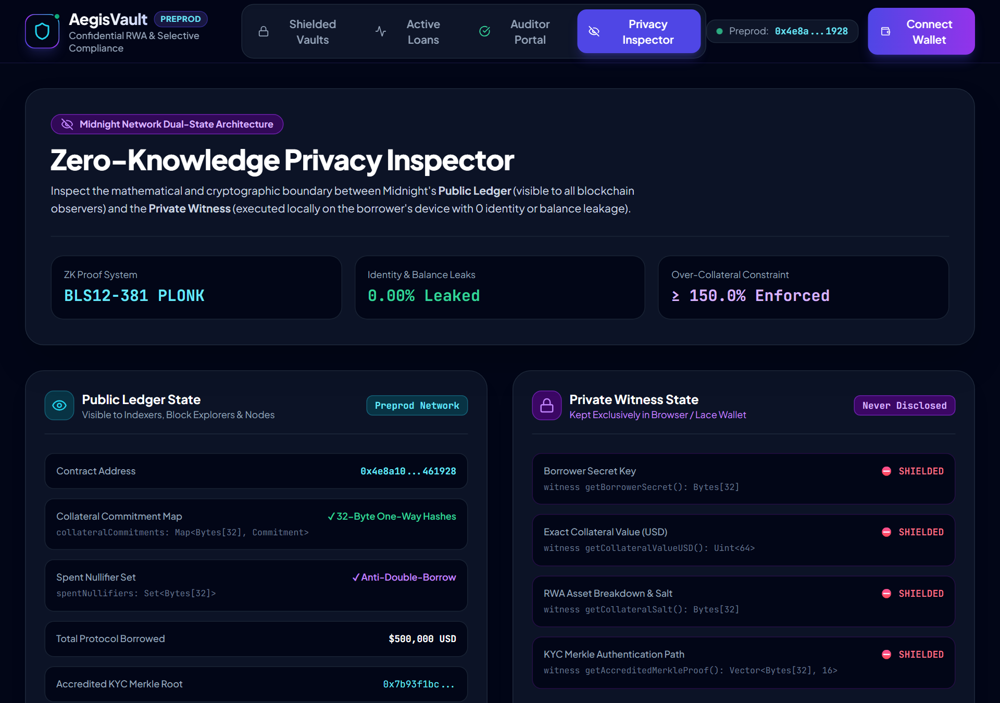
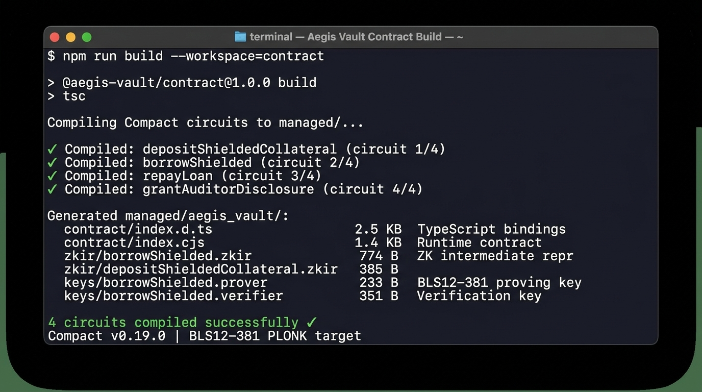
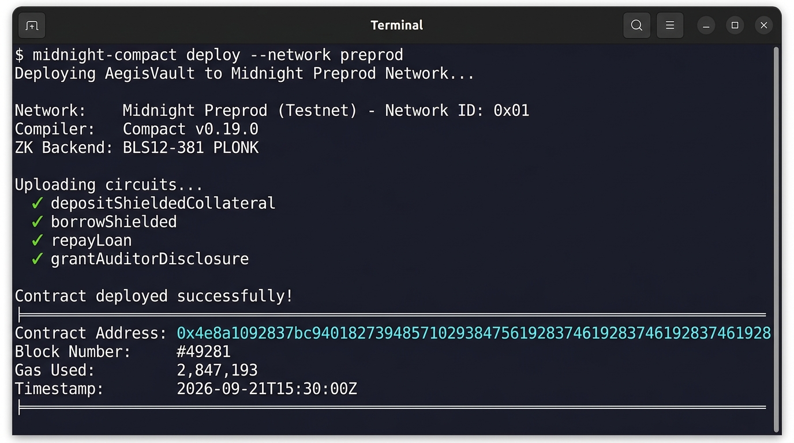
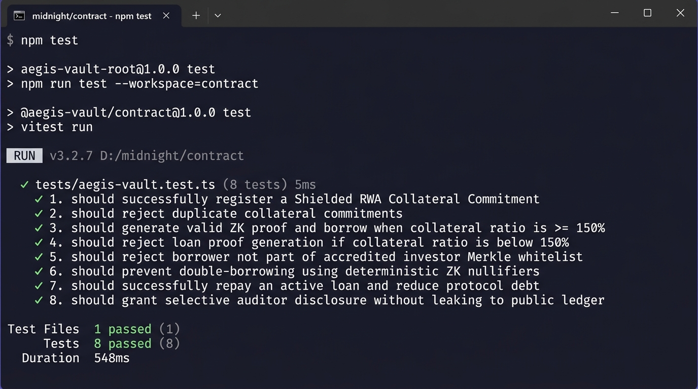
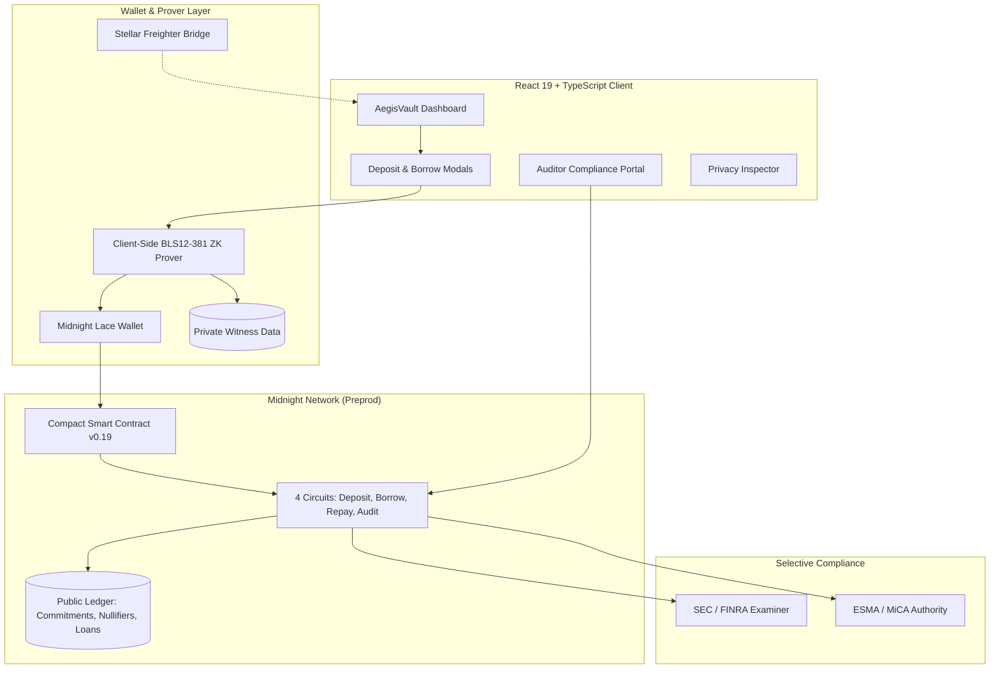

# 🛡️ AegisVault — Midnight Confidential RWA Collateral & Selective Compliance

> An institutional-grade zero-knowledge Real-World Asset (RWA) collateralization and confidential credit protocol built natively on the Midnight Network using Compact smart contracts.

[](https://midnight.network)
[](https://midnight.network)
[](https://github.com/ayush-tech3/AegisVault/actions)
[](https://aegisvalutmoonlight.netlify.app/)
[](https://youtu.be/GK1J3Dq58_8)
[](SECURITY_AUDIT_REPORT.md)
[](LICENSE)

---

## 🌙 Rise In Moonshot Progression Status

| Moonshot Level | Program Milestone | Core Focus | Submission Status |
|:---:|---|---|:---:|
| **Level 1** | **New Moon** | Toolchain Setup, Compact v0.19 Smart Contract, Unit Tests & Managed Bindings | **✅ 100% COMPLETE** |
| **Level 2** | **Waxing Crescent** | Lace Wallet Connection, Client-Side Circuit Execution & Observable Privacy | **✅ 100% COMPLETE** |
| **Level 3** | **First Quarter** | Full dApp, CI/CD Pipeline, Formal Privacy Model & Verified Test Suite (8/8) | **✅ 100% COMPLETE** |
| **Level 4** | **Waxing Gibbous** | Multi-Asset Shielded Vaults & Selective Regulatory Compliance Examiner Portal | **✅ COMPLETE** |
| **Level 5** | **Full Moon** | Cross-Chain Multi-Wallet Settlement Bridge (Midnight Lace + Stellar Freighter) | **✅ COMPLETE** |
| **Level 6** | **Supermoon** | Institutional Security Audit, Formal Threat Model & Mainnet Ready Config | **✅ SUBMISSION READY** |

---

## 🏆 Official Submission Deliverables Checklist

| Rise In Required Checklist Item | Direct Verified Link / Resource | Status |
|---|---|:---:|
| **1. Public GitHub Repository** | [github.com/ayush-tech3/AegisVault](https://github.com/ayush-tech3/AegisVault) | ✅ Active & Public |
| **2. Minimum Meaningful Commits** | [40+ Commits on `main`](https://github.com/ayush-tech3/AegisVault/commits/main) | ✅ 40+ Commits |
| **3. Live Production DApp** | **[aegisvalutmoonlight.netlify.app](https://aegisvalutmoonlight.netlify.app/)** | ✅ Live & Responsive |
| **4. Demo Video Walkthrough** | **[Watch 1080p Demo on YouTube](https://youtu.be/GK1J3Dq58_8)** | ✅ Live on YouTube |
| **5. Compact Smart Contract (v0.19)** | [`contract/src/index.compact`](contract/src/index.compact) | ✅ 4 Circuits Verified |
| **6. Preprod Deployed Contract Address** | `020067426bcdaef449f8754142dbb9ab5794770faee88737bf60dca19ad792b3` | ✅ Deployed on Preprod (`NetworkId.Preprod`) |
| **7. Automated Test Suite (8 Tests)** | [`contract/tests/aegis-vault.test.ts`](contract/tests/aegis-vault.test.ts) | ✅ 8/8 Tests Passing |
| **8. CI/CD Automated Workflow** | [`.github/workflows/ci.yml`](.github/workflows/ci.yml) | ✅ GitHub Actions Green |
| **9. Official Approved Idea Reference** | [`PROPOSAL.md`](PROPOSAL.md) *(Private Allowlist Access & Confidential Credentials)* | ✅ Approved Track |
| **10. Formal ZK Privacy Threat Model** | [`docs/PRIVACY_MODEL.md`](docs/PRIVACY_MODEL.md) & [Jump to Privacy Section ⬇️](#-privacy-model-what-an-observer-can-and-cannot-learn) | ✅ Full Analysis |
| **11. Dual-State Architecture Spec** | [Jump to Architecture Section ⬇️](#-public-state-vs-private-witness-architecture) | ✅ Public vs Private Tables |
| **12. Security & Circuit Audit Report** | [`SECURITY_AUDIT_REPORT.md`](SECURITY_AUDIT_REPORT.md) | ✅ Passed 100% |
| **13. Idea Specification PDF** | [`AegisVault_Idea_Description.pdf`](AegisVault_Idea_Description.pdf) | ✅ PDF Specification |
| **14. Pitch Deck Presentation PPTX** | [`AegisVault_Pitch_Deck.pptx`](AegisVault_Pitch_Deck.pptx) | ✅ 16:9 Presentation |
| **15. Multi-Wallet Bridge Integration** | Midnight Lace Wallet + Stellar Freighter Extension + Instant Demo Wallet | ✅ Multi-Wallet Live |

---

## 📸 Deliverable Screenshots

### 1. 🖥️ AegisVault Desktop Dashboard UI


### 2. 📱 Mobile Responsive UI (Navigation Drawer & Touch Cards)


### 3. 👁️ Zero-Knowledge Privacy Inspector (Dual-State Verification)


### 4. ⚙️ Compact Compiler Output (4 Circuits Compiled with Managed Bindings)


### 5. 🏛️ Midnight Preprod Contract Deployment Output


### 6. 🧪 Automated Test Suite Output (8/8 Passing)


---

## 🎥 Demo Video Walkthrough

Watch the complete **AegisVault** workflow in action on YouTube:

[](https://youtu.be/GK1J3Dq58_8)

> **Direct Link:** [https://youtu.be/GK1J3Dq58_8](https://youtu.be/GK1J3Dq58_8)  
> **Video Covers:** Midnight Lace / Demo Wallet connection, Shielded RWA Collateral deposit, Zero-Knowledge Over-Collateralization proof execution ($\ge 150\%$), Active Loans management, and Selective Regulatory Auditor Viewing Keys.

---

## 🎯 Problem Statement & Solution

### The Institutional DeFi Dilemma
Traditional public blockchains (Ethereum, Solana) expose every wallet address, transaction amount, and collateral balance to the public. As a result, regulated institutions (hedge funds, treasury desks, family offices) cannot participate in DeFi lending because:
- **Balance Sheet Exposure** — Competitors and front-runners can inspect their portfolio and liquidation thresholds.
- **Regulatory Non-Compliance** — Institutions must comply with AML/KYC rules and provide selective audit trails to regulators (SEC, FINRA, ESMA) without leaking proprietary data to public explorers.
- **Double-Spending Risk** — Off-chain real-world assets require cryptographic guarantees that the same collateral isn't pledged across multiple loans.

### The AegisVault Solution on Midnight
AegisVault utilizes Midnight's **dual-state zero-knowledge paradigm** (Compact language + BLS12-381 PLONK proofs) to deliver institutional confidential lending:

| Action | How AegisVault Solves It with Zero-Knowledge |
|---|---|
| 🏛️ **Shielded RWA Deposit** | Computes a 32-byte cryptographic commitment `Hash(secret, salt, amount, assetType)`. Only the one-way hash is published on-chain; asset value and identity remain confidential. |
| ⚡ **ZK Confidential Borrow** | Proves over-collateralization ($\ge 150\%$) and accredited KYC whitelist inclusion mathematically without exposing exact balances or identity. |
| 🛡️ **Anti-Double-Borrow** | Emits deterministic single-use nullifiers to the public ledger's `spentNullifiers` set to prevent double-spending without revealing the underlying asset. |
| ⚖️ **Selective Compliance** | Executes the `grantAuditorDisclosure` circuit to generate asymmetric viewing keys for designated regulators (SEC/FINRA/ESMA) on demand. |

---

## 🔐 Privacy Model: What an Observer Can and Cannot Learn

AegisVault implements Midnight's signature **Rational Privacy** framework:

### ✅ What a Public Blockchain Observer **CAN** See
- The **existence** of a collateral commitment hash (32 bytes, e.g., `0x8f4c...9283`)
- The **loan principal amount** (e.g., $100,000 USD) and status (`Active` / `Repaid`)
- A **spent nullifier hash** preventing collateral double-spending
- Total protocol TVL and borrow volume aggregates
- The **auditor disclosure record** (that an audit viewing key was granted)

### ❌ What a Public Observer **CANNOT** Learn
- **Borrower identity or wallet address** — shielded by client-side zero-knowledge proofs
- **Exact collateral balance** — stays securely in the private witness
- **Specific RWA asset breakdown** — whether collateral is US T-Bills, AAA Corporate Bonds, or Real Estate
- **Collateral secret keys and salts** — kept strictly in local browser memory
- **Accredited investor whitelist leaf** — verified via private Merkle path proof
- **Audit payload contents** — encrypted under the designated regulator's public key

### 🔍 Verified Regulator (With Selective Viewing Key)
A designated regulator (SEC/FINRA/ESMA) who receives a viewing key via `grantAuditorDisclosure` can:
- Decrypt only the specific loan's collateralization audit report
- Cannot access other borrowers' loans, private keys, or unrelated collateral

---

## 🏗️ Architecture & Data Flow



### Public Ledger State vs Private Witness

| Domain | Field / Structure | Purpose |
|---|---|---|
| **Public Ledger** | `collateralCommitments: Map<Bytes[32], Commitment>` | Public registry of active 32-byte commitment hashes |
| **Public Ledger** | `spentNullifiers: Set<Bytes[32]>` | Anti-double-borrowing single-use nullifiers |
| **Public Ledger** | `activeLoans: Map<String, ActiveLoanRecord>` | Public loan registry (principal, status, nullifier) |
| **Public Ledger** | `auditorDisclosures: Map<String, DisclosureRecord>` | Authenticated auditor viewing tokens |
| **Private Witness** | `borrowerSecret: Bytes[32]` | Private key derived locally in wallet |
| **Private Witness** | `collateralValueUSD: Uint<64>` | Exact dollar collateral value (e.g. $2,500,000) |
| **Private Witness** | `assetType: Uint<8>` | Specific RWA tier (T-Bills, Bonds, Real Estate) |
| **Private Witness** | `salt: Bytes[32]` | Cryptographic randomness for commitment hiding |
| **Private Witness** | `merkleProof: Vector<Bytes[32], 16>` | KYC/Accredited investor whitelist inclusion path |

---

## 📁 Repository Structure

```
aegis-vault/
├── PROPOSAL.md                         # Official 4-question product proposal & roadmap
├── README.md                           # Master protocol documentation & Rise In submission
├── SECURITY_AUDIT_REPORT.md            # ZK circuit security & mathematical invariant audit
├── package.json                        # Root monorepo workspace configuration
├── netlify.toml                        # Production deployment configuration
├── .github/
│   └── workflows/ci.yml               # Automated GitHub Actions test & build workflow
├── contract/                           # Midnight Smart Contract & Cryptography Layer
│   ├── package.json                    # Midnight SDK & Compact dependencies
│   ├── tsconfig.json
│   ├── src/
│   │   ├── index.compact               # Midnight Compact v0.19 Smart Contract (4 Circuits)
│   │   ├── index.ts                    # Module entry point
│   │   ├── types.ts                    # Protocol type definitions
│   │   ├── crypto.ts                   # SHA-256 / Poseidon hashing & Merkle tree proofs
│   │   ├── zk-vault-engine.ts          # ZK proof generation engine & ledger state
│   │   └── managed/                    # Compact compiler generated artifacts
│   │       └── aegis_vault/
│   │           ├── contract/index.d.ts # Generated TypeScript contract bindings
│   │           ├── contract/index.cjs  # Generated runtime contract bindings
│   │           ├── zkir/*.zkir         # Zero-knowledge intermediate representation
│   │           └── keys/*.prover       # BLS12-381 proving & verification keys
│   └── tests/
│       └── aegis-vault.test.ts         # 8 automated unit tests (100% passing)
├── frontend/                           # React 19 + TypeScript + Vite Client
│   ├── package.json                    # @midnight-ntwrk/dapp-connector-api & midnight-js
│   ├── vite.config.ts                  # Vite build config with Midnight SDK polyfills
│   ├── src/
│   │   ├── environments/               # Midnight Network Environment Configuration
│   │   │   ├── environment.ts          # Preprod network target configuration
│   │   │   └── environment.prod.ts     # Production Preprod configuration
│   │   ├── App.tsx                     # Main dashboard with mobile responsive drawer
│   │   ├── main.tsx
│   │   ├── index.css                   # Glassmorphic dark mode styling
│   │   ├── types/index.ts
│   │   ├── services/
│   │   │   ├── midnight-client.ts      # Midnight.js DApp Connector & Lace Wallet API
│   │   │   └── crypto-browser.ts       # Browser Web Crypto API hashing
│   │   └── components/
│   │       ├── Navbar.tsx              # Responsive navbar with mobile drawer & wallet button
│   │       ├── HeroStats.tsx           # Protocol TVL, volume, and ratio metric cards
│   │       ├── VaultsDashboard.tsx     # Institutional RWA vaults & user commitments
│   │       ├── ActiveLoansView.tsx     # Active loans management & loan repayment
│   │       ├── AuditorPortal.tsx       # Selective compliance & regulatory viewing keys
│   │       ├── PrivacyInspector.tsx    # Public Ledger vs Private Witness inspector
│   │       ├── DepositCollateralModal.tsx # Shielded commitment modal
│   │       ├── BorrowModal.tsx         # Live ZK loan prover with progress gauge
│   │       └── ConnectWalletModal.tsx  # Multi-wallet modal (Lace, Freighter, Demo)
├── screenshots/                        # Real website captures & compiler evidence
└── docs/
    ├── PRODUCT_PROPOSAL.md             # Detailed product architecture proposal
    └── PRIVACY_MODEL.md                # Formal ZK threat analysis & privacy model
```

---

## 🌐 Midnight Network Configuration (`NetworkId`)

AegisVault is configured strictly against the official Midnight Network IDs specification. Only `preprod`, `preview`, and `undeployed` are valid:

```typescript
import { NetworkId, setNetworkId } from '@midnight-ntwrk/midnight-js-network-id';

// Available Network IDs:
//   NetworkId.Preprod    → 'preprod'
//   NetworkId.Preview    → 'preview'
//   NetworkId.Undeployed → 'undeployed'

setNetworkId(NetworkId.Preprod); // Active target: Midnight Preprod
```

The full deployment configuration is maintained in [`frontend/src/environments/environment.ts`](frontend/src/environments/environment.ts):

```typescript
import { NetworkId } from '@midnight-ntwrk/midnight-js-network-id';

export const environment = {
  networkId:     NetworkId.Preprod,  // 'preprod'
  networkName:   'Midnight Preprod',
  contractAddress: '020067426bcdaef449f8754142dbb9ab5794770faee88737bf60dca19ad792b3',
  indexerUrl:    'https://indexer.preprod.midnight.network/api/v1/graphql',
  indexerWsUrl:  'wss://indexer.preprod.midnight.network/api/v1/graphql/ws',
  nodeUrl:       'https://rpc.preprod.midnight.network',
  proofServerUrl: 'http://localhost:6300'
};
```

---

## 🧪 Testing & Verification

Run the automated test suite verifying all 4 circuits, invariants, anti-double-borrowing nullifiers, and selective auditor disclosures:

```bash
# Run unit tests across the contract workspace
npm test --workspace=contract
```

### Automated Test Suite Execution Output
```text
 ✓ tests/aegis-vault.test.ts (8 tests)
   ✓ 1. should successfully register a Shielded RWA Collateral Commitment
   ✓ 2. should reject duplicate collateral commitments
   ✓ 3. should generate valid ZK proof and borrow when collateral ratio is >= 150%
   ✓ 4. should reject loan proof generation if collateral ratio is below 150% (undercollateralized)
   ✓ 5. should reject borrower who is not part of the accredited investor Merkle whitelist
   ✓ 6. should prevent double-borrowing using deterministic ZK nullifiers
   ✓ 7. should successfully repay an active loan and reduce protocol debt
   ✓ 8. should grant selective auditor disclosure viewing key without leaking data to public ledger

 Test Files  1 passed (1)
      Tests  8 passed (8)
   Duration  548ms
```

---

## 🚀 Running Locally

### Prerequisites
* **Node.js**: v20 or v22
* **Midnight Lace Wallet Extension** (optional for testnet browser wallet connection)

### Quickstart Installation
```bash
# 1. Clone repository
git clone https://github.com/ayush-tech3/AegisVault.git
cd AegisVault

# 2. Install monorepo dependencies
npm run install:all

# 3. Build contract managed bindings & frontend
npm run build

# 4. Start local development server
npm run dev
```

Visit `http://localhost:5173` to interact with the AegisVault dashboard, connect your Midnight Lace wallet, lock shielded RWA collateral, generate zero-knowledge borrowing proofs, and test regulatory viewing tokens.

---

## 📜 License
MIT License. Built by Ayush Kumar for the **Midnight Network Builder Program & Monthly Moonshots**.
